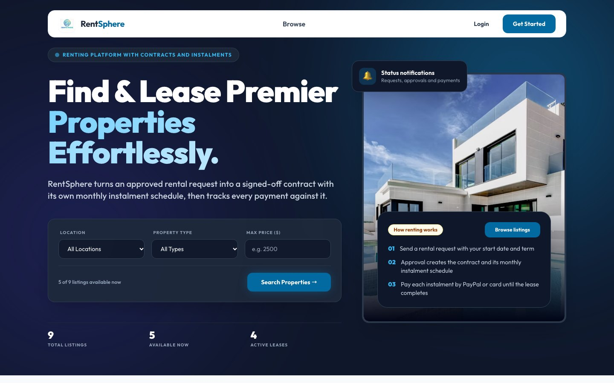
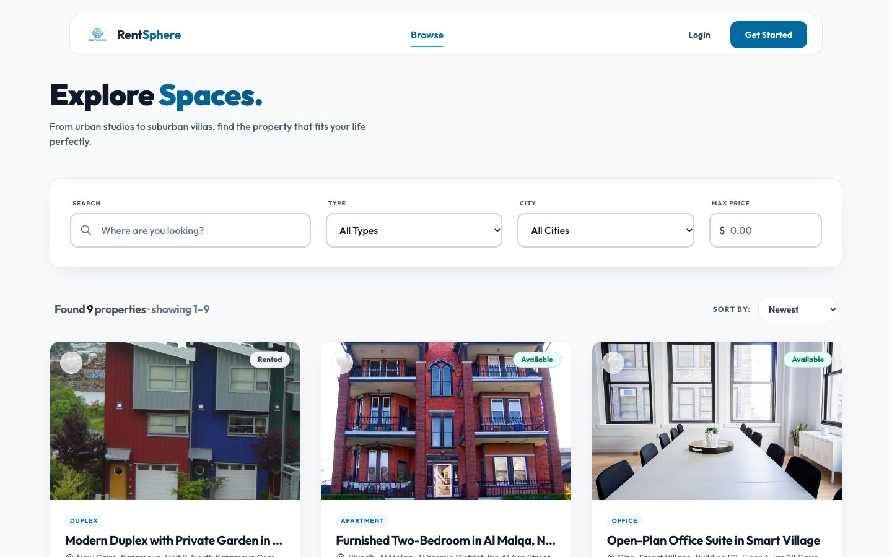
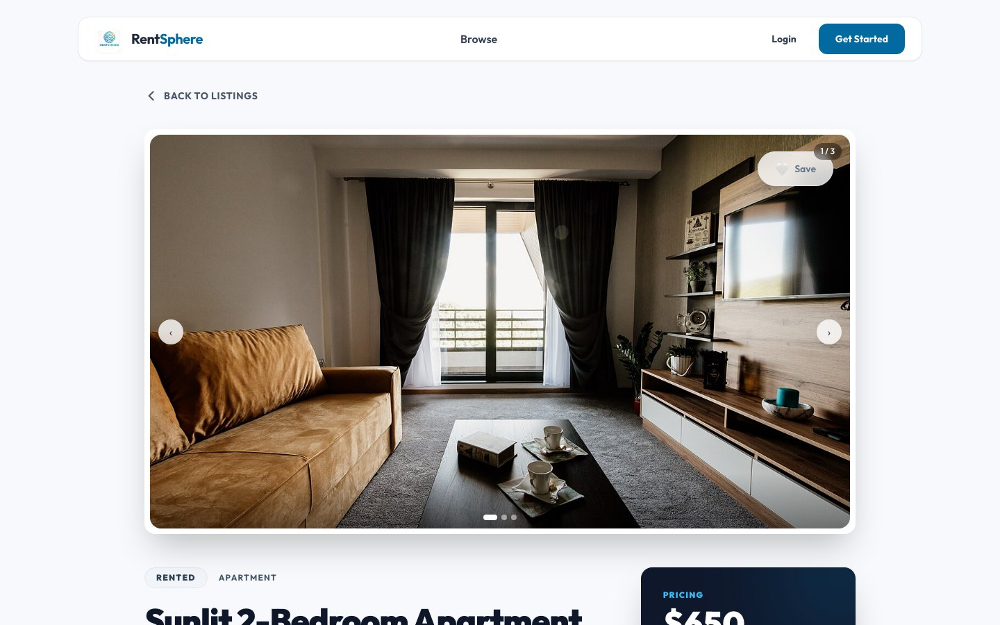
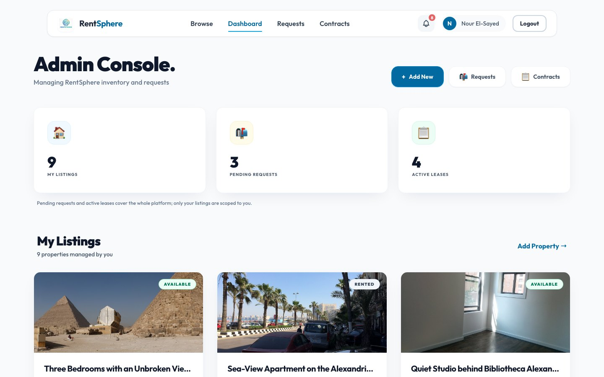
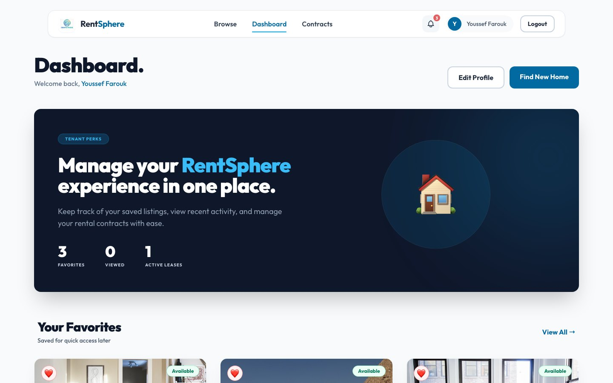
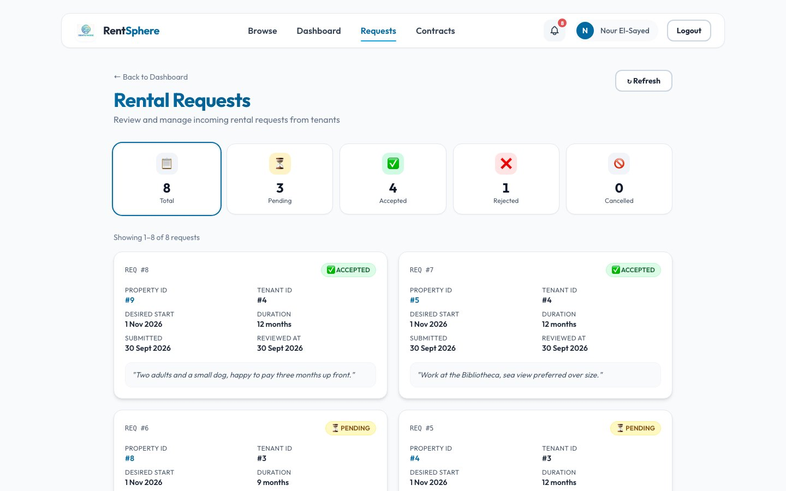
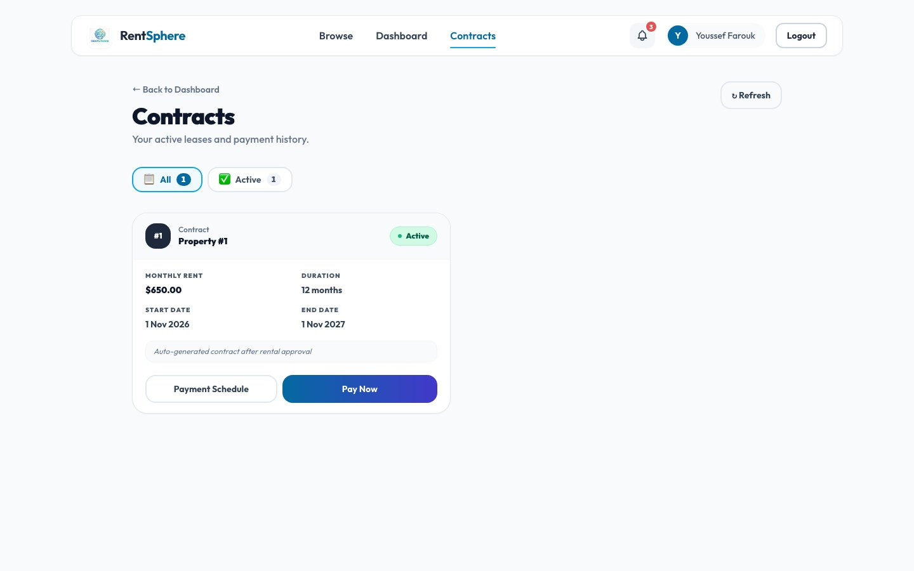

# RentSphere

A rental platform where owners list properties and tenants browse, request a lease and pay
rent monthly. When an owner accepts a request, the backend creates the contract and its full
payment schedule in one transaction.

**Live demo:** https://rentsphere-5jpa.onrender.com
· **API docs (Swagger):** https://rentsphere-api.onrender.com/swagger-ui/index.html

Log in with `nour.elsayed@nilenest.demo` (owner) or `youssef.farouk@mail.demo` (tenant),
password `RentSphereDemo2026`. The demo logins are shared, so their profiles are read-only.
It runs on Render's free plan; a scheduled GitHub Action pings the health check to keep the
API awake, and if it has slept anyway the first request takes about a minute.

Java 17 · Spring Boot 3 · Spring Security · JdbcTemplate · MySQL 8 · React · Tailwind · Docker · Nginx · GitHub Actions



## Performance

I seeded 100k listings and 300k images and load-tested the read path with JMeter.

| | Before | After |
|---|---:|---:|
| Avg latency, 50 users | 1,808 ms | 22 ms |
| Search, 50 users | 8,036 ms | 82 ms |
| p95, 100 users | - | 77 ms |
| 200 concurrent users | - | 0% errors, ~120 req/s |

What I changed, all in `PropertyController` and `PropertyRepository`:

- **Paging.** The listing endpoint returned every match (one search sent back 14,286 rows,
  8 MB of JSON). It now uses `LIMIT/OFFSET` with the page size capped at 48.
- **N+1 fix.** Each row used to run its own image query, about 28,500 queries per search.
  Images for a page are now loaded in one batched `WHERE property_id IN (...)` query
  (`buildPropertyDetailsBatch`).
- **Indexes.** I ran `EXPLAIN` on every query the app sends (`Performance/db-benchmark.sql`)
  and dropped the 6 indexes nothing used, 18 → 12.
- **Full-text search.** `LIKE '%term%'` was a full table scan, so search now uses a `FULLTEXT`
  index with `MATCH ... AGAINST`, falling back to `LIKE` on H2 in tests. (Added after the run
  above, not load-tested yet.)

Test plan, seed script, raw results and JMeter screenshots: [Performance/](Performance/README.md)

## Security

- Stateless JWT auth (24-hour tokens) with BCrypt-hashed passwords and 3 roles (`ADMIN` for
  listing owners, `TENANT`, `VISITOR`). Registration always creates a `VISITOR`
- Least privilege: owner routes need the `ADMIN` role in both the filter chain and
  `@PreAuthorize`, and every query behind them is scoped to the caller. An owner sees only
  the requests and contracts on their own listings, only the tenant on a contract can pay it,
  and no role can read another user's data
- Changing an email or password needs the current password, so a stolen token is not enough
  to take an account over
- Per-IP rate limiting in the app (15 logins or sign-ups, 90 writes, 600 requests a minute)
  and a 64 KB cap on request bodies; the Compose stack also rate-limits in Nginx
- Every request DTO is validated against the column it is stored in, and free text rejects
  markup and control characters. Image links must be `https` or a path under `/uploads`
- All SQL is parameterized, sort columns go through a whitelist, and full-text search input
  is reduced to words before it reaches `MATCH ... AGAINST`
- PayPal payments are always created in USD with return URLs on this site, and the captured
  amount and currency are checked before an instalment is marked paid
- CORS only allows the configured frontend origin
- Errors use one JSON shape and never include SQL or stack traces
- HSTS, `X-Frame-Options`, `X-Content-Type-Options` and `Referrer-Policy` on the API, plus a
  Content-Security-Policy on the frontend
- Only `/actuator/health` is public, and it reports the status alone

## Data and transactions

- 8 MySQL tables with foreign keys and `CHECK` constraints on every status/type column
- `UNIQUE (contract_id, installment_no)` so the same instalment can't be paid twice
- Accepting a request is one `@Transactional` call that creates the contract and one payment
  row per month and takes the listing off the market, so it cannot be let twice. Card and
  PayPal payments are transactional too
- A tenant can hold one pending request per listing, only for an available listing that is
  not their own, starting within the next 12 months
- A `@Scheduled` daily job sends reminders 3 days and 1 day before a due date, marks late
  instalments overdue, cancels contracts that stay unpaid and puts their listings back on
  the market

## Observability and docs

- Each request gets an `X-Correlation-ID`, stored in the logging MDC and returned in the
  response header
- JSON logs (Logstash encoder) in the `prod` profile
- Spring Boot Actuator health check, which Render uses to check the deploy
- OpenAPI 3 / Swagger UI for all 31 endpoints
- Javadoc on the controllers, services, repositories and security classes
  (`cd Backend && ./mvnw javadoc:javadoc`)

## Deployment

- **Live:** Spring Boot runs as a Docker web service on Render, the React build is a Render
  static site, and the database is MySQL on Aiven. Everything is defined in
  [`render.yaml`](render.yaml), including JVM flags for the 512 MB instance
  (`MaxRAMPercentage`, `SerialGC`) and a smaller Hikari pool
- **Local:** Docker Compose runs MySQL (with a health check), the API, the frontend and the
  Nginx proxy. Backend and frontend images are multi-stage builds
- **AWS EC2 (first deploy):** before Render, the whole Compose stack ran on an EC2 instance.
  `deploy/setup-ec2.sh` sets up a fresh Ubuntu server (Docker, swap, firewall, generated
  secrets) and starts it, and the CI pipeline has an SSH deploy job for it. I moved to Render
  when the AWS free tier ran out

## Tests and CI

- 230 backend tests (JUnit 5, Mockito, MockMvc, H2) with a JaCoCo coverage report (~70% lines)
- 67 frontend tests (Jest, React Testing Library, jest-axe)
- GitHub Actions runs both suites and builds the Docker images on every push

```bash
cd Backend && ./mvnw test
cd Frontend && CI=true npm test
```

## Features

**Tenants** search by city, district, type and price, save favourites, send rental requests,
and pay instalments by card or PayPal (sandbox). They get notified when a request is reviewed
or a payment goes through.

**Owners** manage listings and photos, accept or reject requests, and track leases and
outstanding payments from an admin dashboard.

| | |
|---|---|
|  |  |
|  |  |
|  |  |

## Run it locally

```bash
git clone https://github.com/ixi3boda/RentSphere.git
cd RentSphere
cp .env.example .env          # set the passwords and a JWT secret (32+ chars)
docker compose up --build
```

The app is at http://localhost (through Nginx), the API on `:8080`, MySQL on `:3306`.
The tables start empty. To load the demo data:

```bash
set -a; source .env; set +a
docker compose exec -T mysql mysql -u"$MYSQL_USER" -p"$MYSQL_PASSWORD" \
  RentSphereSchema < Backend/src/main/resources/db/seed-demo.sql
```

The demo data uses dates relative to the day it is loaded, so leases and instalments are
always current. Use `Database/seed-large-dataset.sql` instead for the 100k-row load-test data.

### Deploy your own copy on Render

1. Create a free MySQL database on [Aiven](https://aiven.io) and load `Database/Schema.sql`
   and `Backend/src/main/resources/db/seed-demo.sql` into it.
2. In Render, choose **New → Blueprint** and pick this repo. Fill in the database URL,
   user and password, and the PayPal sandbox keys.
3. If Render changes the service names, update `REACT_APP_API_URL` and
   `RENTSPHERE_CORS_ALLOWED_ORIGINS` to the real URLs.
4. Optional, for a public demo only: set `RENTSPHERE_DEMO_RESET_ENABLED=true` on the API. It
   reloads the demo data on every start and once a day, which **empties every table**, so
   whatever visitors added or changed through the shared logins is gone within a day.

## Project layout

```
Backend/       Spring Boot API (Controller / Service / Repository / Dto / SecurityConfig)
Frontend/      React app
Database/      Schema.sql and seed scripts
Nginx/         reverse proxy config
Performance/   JMeter plan, EXPLAIN scripts, results
deploy/        VM setup script
render.yaml    Render deployment
```

## Author

Abdelrahman Essam · [LinkedIn](https://www.linkedin.com/in/abdelrahman-essam-a677a6328/) · [GitHub](https://github.com/ixi3boda)
